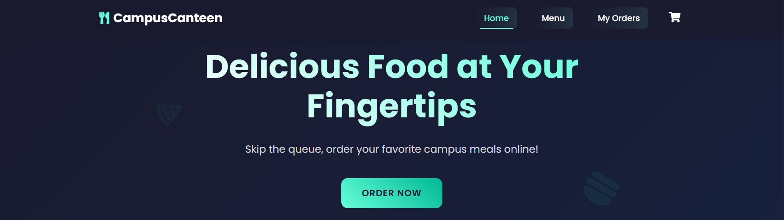

# 🍽️ BiteHack – Elevate Your Restaurant’s Digital Presence



**BiteHack** is a modern, responsive, and visually aesthetic website template designed for restaurants, cafés, and food businesses. It’s crafted to offer an engaging user experience while effectively showcasing your brand, menu, and culinary style online.

> Live Site: [https://bite-hack.vercel.app](https://bite-hack.vercel.app)

---

## 🧭 Table of Contents

- [🔍 Overview](#-overview)
- [🚀 Features](#-features)
- [📸 Screenshots](#-screenshots)
- [🛠️ Tech Stack](#-tech-stack)
- [📁 Project Structure](#-project-structure)


---

## 🔍 Overview

**BiteHack** is built with simplicity and style in mind. It allows restaurant owners and developers to:

- Display featured dishes with imagery, categories, and prices
- Highlight brand identity with consistent color palettes and typography
- Ensure responsiveness across all devices (mobile, tablet, desktop)
- Deploy instantly using platforms like Vercel, Netlify, or GitHub Pages

This project is ideal for static websites and can be easily extended with backend functionality like online reservations, ordering systems, or CMS integrations.

---

## 🚀 Features

| Feature | Description |
|--------|-------------|
| 🎯 **Minimalist Design** | Clean layout to keep the user’s focus on food offerings |
| 📱 **Mobile Responsive** | Optimized for all devices with smooth scrolling experience |
| 🖼️ **Visual Menu Layout** | Food items organized with image, name, category, and price |
| 🎨 **Custom Branding** | Blue theme and food pattern background to enhance visual identity |
| ⚡ **Fast Performance** | Lightweight assets and minimal scripts for quick load times |
| 💡 **Easy Customization** | Modify HTML/CSS to adapt the template to your brand needs |

---

## 📸 Screenshots

> Replace these URLs with actual hosted screenshots or GitHub repo images.

### 🏠 Homepage


### 📋 Menu Section


### 📋 Order Section


---

## 🛠️ Tech Stack

| Technology | Role |
|------------|------|
| **HTML5** | Structure and semantic markup |
| **CSS3** | Styling, layout, animations |
| **JavaScript (Vanilla)** | Basic interactivity |
| **Vercel** | Deployment and hosting |
| *(Optional)* GitHub | Version control and collaboration |

---

## 📁 Project Structure

```bash
bite-hack/
├── assets/               # Images and media
│   ├── images/           # Food, banner, and UI assets
│   └── patterns/         # Background design elements
├── index.html            # Homepage HTML
├── style.css             # Custom stylesheet
└── README.md             # Project documentation
